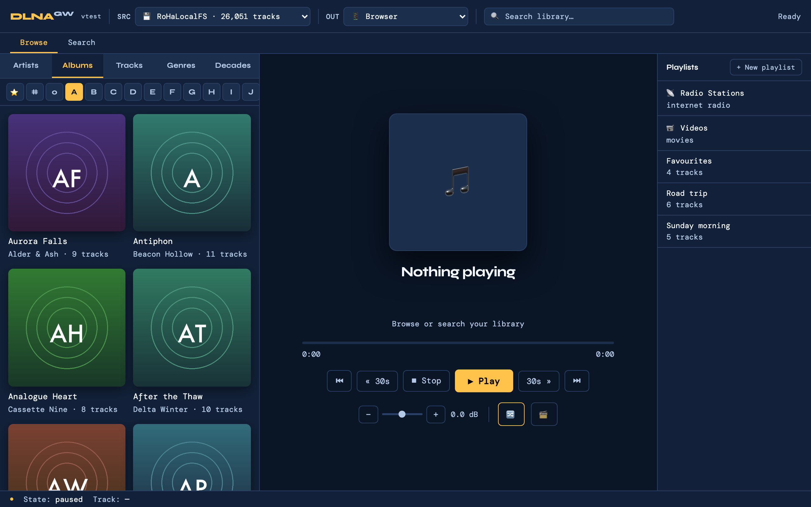
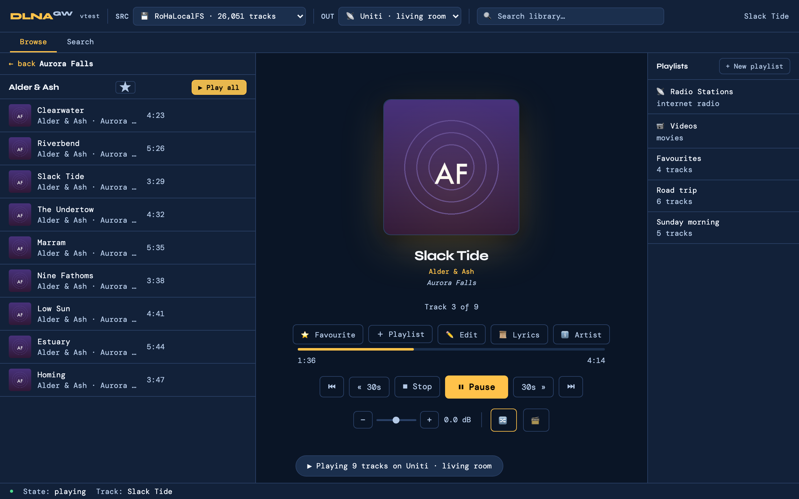
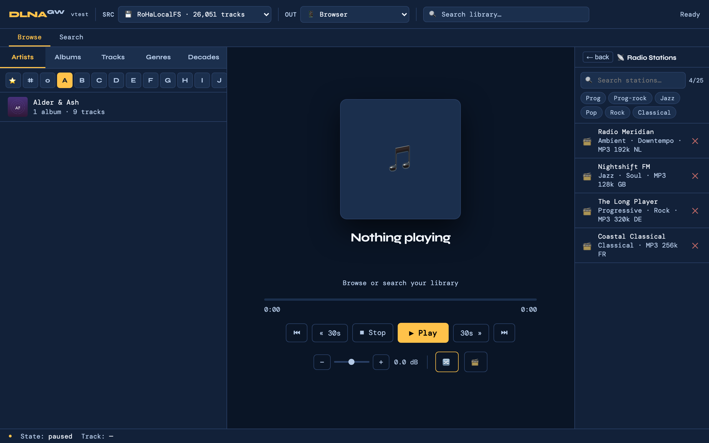
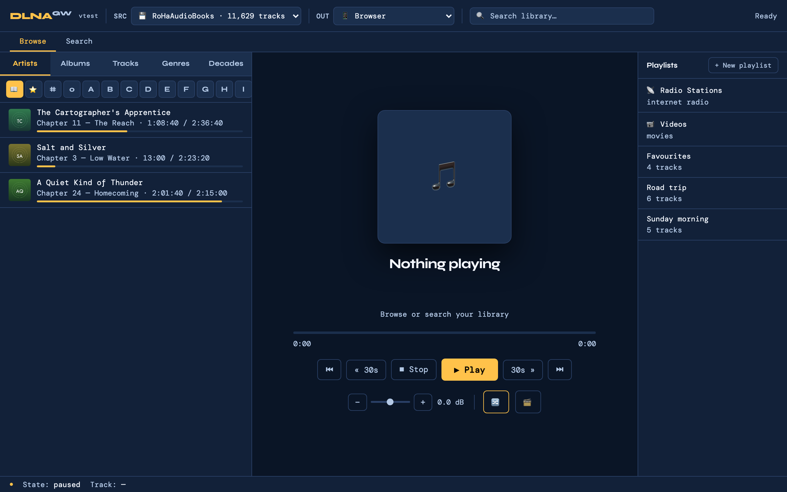
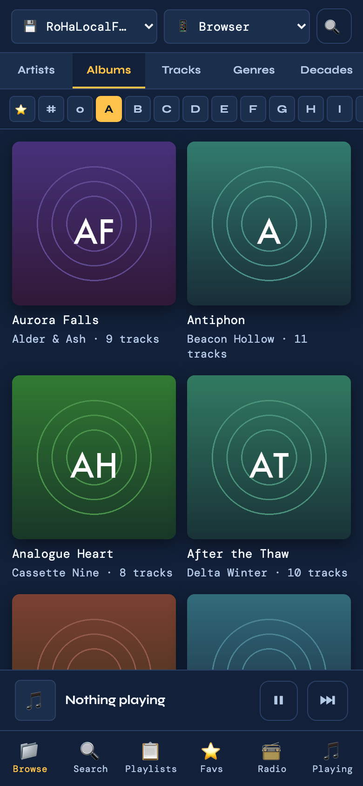

# DLNA Gateway

[](LICENSE)
[](https://www.python.org/)
[](#testing)
[](SECURITY.md)

**Your music, on your hi-fi, from your own files — with a web app that is
actually fast.**

A self-hosted UPnP/DLNA music gateway. Point it at a folder of music (or at
any UPnP media server you already run), and it gives you a browsable library
in the browser, on your phone, on your streamer, and in the car. Built
because the manufacturer apps — Focal & Naim and friends — are slow, flaky,
or locked to one platform.



## Why you might want it

- **Bit-perfect to your hi-fi.** For a UPnP renderer the gateway is *not in
  the audio path*: it sends `SetURI` + `Play` and the streamer pulls the
  original bytes straight off disk. No transcoding, no resampling, no mixer.
  The volume slider drives the renderer's own hardware volume.
- **It indexes your files, not someone else's catalogue.** The built-in
  RoHaLocalFS backend reads the tags in your folder and serves the files
  itself — no second media server to install, run and keep in sync.
- **It works in the car.** A Subsonic-compatible API means a native client
  like [Amperfy](https://github.com/BLeeEZ/amperfy) gives you proper
  **CarPlay**, which a web app fundamentally cannot.
- **Audiobooks that resume anywhere.** The bookmark lives on the server, per
  book — so a chapter you stopped on the streamer picks up in the car, and
  then on your phone in the kitchen.
- **Your streamer can browse it directly.** The gateway announces *itself*
  as a DLNA Media Server, so the Naim's own front panel sees your whole
  library — artists, albums, genres, playlists, favourites — with no phone
  involved.
- **One person's real library.** ~26,000 tracks, ~11,600 audiobook chapters
  and a few thousand videos, in daily use. The awkward parts — duplicate
  editions, compilations scattered across folders, FTS corruption, renderers
  that stop answering — are handled because they had to be.

| Now playing | Internet radio |
|---|---|
|  |  |

| Audiobooks — continue listening | On a phone |
|---|---|
|  |  |

> Screenshots are generated from a synthetic library by
> `tools/screenshots.py`, which drives the same stub the browser test suite
> uses — so they are reproducible, and they are not anyone's listening
> history.

---

## Quick start (macOS)

```bash
git clone <your-fork-url> dlna-gateway
cd dlna-gateway
cp .env.example .env       # then edit to set SUBSONIC_PASSWORD etc.
./setup.sh --run           # creates a venv, installs deps, starts the gateway
```

Open `http://localhost:8765/` in any browser.

**Running the 2.0 ASGI stack (Hypercorn + TLS/HTTP-2).** The gateway IS the
Hypercorn-served `dlna_asgi:app` — `./setup.sh --run` launches it via
**`./run-2.0-asgi.sh`** (`GATEWAY_TLS=1` to terminate TLS+h2 on `:8443`,
auto-discovering a `tailscale cert`). The Naim-facing `/gw/*` UPnP surface is
served by the app on the plain `:8765` bind; RoHaLocalFS (`:8200`) runs
in-process — both stay plain HTTP for the Naim. `python dlna_gateway.py` is no
longer a server (Cleanup C); it keeps only `--list-devices` / `--reset-devices`.
For auto-start at login: see the comments at the top of
`com.roha.dlna-gateway.plist` (it's a LaunchAgent template — edit the
path placeholders, copy to `~/Library/LaunchAgents/`, `launchctl load`).

Once it's running under launchd, restart it after a code change with
`./setup.sh --restart` — it refreshes the venv/dependencies and then
`launchctl kickstart`s the LaunchAgent (the launchd-correct restart; a
bare `kill` races launchd's respawn).

## Quick start (Linux)

```bash
git clone <your-fork-url> dlna-gateway
cd dlna-gateway
cp .env.example .env       # then edit
python3 -m venv .venv && source .venv/bin/activate
pip install -r requirements.txt
hypercorn dlna_asgi:app --bind 0.0.0.0:8765
```

Open `http://<host>:8765/`.

> **The gateway IS the ASGI app.** `python dlna_gateway.py` does **not**
> start a server any more (that changed in 2.0 / Cleanup C) — it only
> keeps the `--list-devices` / `--reset-devices` device-DB tools. Always
> launch via Hypercorn. For TLS + HTTP/2, add
> `--bind 0.0.0.0:8443 --insecure-bind 0.0.0.0:8765 --certfile <host>.crt
> --keyfile <host>.key` (that is exactly what `run-2.0-asgi.sh` does on
> macOS, plus cert auto-discovery).

For autostart, drop something like this into
`~/.config/systemd/user/dlna-gateway.service`:

```ini
[Unit]
Description=DLNA Gateway
After=network-online.target

[Service]
Type=simple
WorkingDirectory=%h/dlna-gateway
EnvironmentFile=%h/dlna-gateway/.env
ExecStart=%h/dlna-gateway/.venv/bin/hypercorn dlna_asgi:app --bind 0.0.0.0:8765
Restart=on-failure
RestartSec=10

[Install]
WantedBy=default.target
```

Then `systemctl --user daemon-reload && systemctl --user enable --now dlna-gateway`.

## Quick start (Windows)

**Recommended:** install [WSL2](https://learn.microsoft.com/en-us/windows/wsl/install)
and follow the Linux instructions inside your WSL distro. Everything
just works.

**Native (no WSL):** open PowerShell:

```powershell
git clone <your-fork-url> dlna-gateway
cd dlna-gateway
copy .env.example .env       # then edit
python -m venv .venv
.\.venv\Scripts\Activate.ps1
pip install -r requirements.txt
hypercorn dlna_asgi:app --bind 0.0.0.0:8765
```

(Same note as Linux: `python dlna_gateway.py` is not a server in 2.0.)

For autostart use [NSSM](https://nssm.cc/) to wrap that Hypercorn command
as a Windows Service. You may also need to allow inbound TCP
8765/8443 and UDP 1900 in Windows Firewall.

## Configuration

All configuration lives in `.env` (gitignored). Copy `.env.example`
to `.env` and edit. Variables:

- `SUBSONIC_USER` / `SUBSONIC_PASSWORD` — auth for the `/rest/*`
  Subsonic API. Leave password empty to refuse all Subsonic calls
  (the API then returns `503` on every request — safe default if
  you don't use CarPlay clients).
- `GATEWAY_CONTACT_EMAIL` — sent in the User-Agent of outbound calls
  to MusicBrainz, Cover Art Archive, and radio-browser.info. Their
  ToS requires an identifying email; anonymous-looking requests get
  throttled or blocked.
- `TAILSCALE_CERT_HOST` — only needed if you use `renew-cert.sh`
  for automated Tailscale cert renewal. Your tailnet hostname,
  e.g. `mymachine.tailXXXXX.ts.net`.
- `ACOUSTID_API_KEY` — **no longer used by the gateway** (the in-process
  AcoustID worker was removed in 2.0; beets manages its own AcoustID lookups).
  Harmless if still present in `.env`. beets' fingerprint matching is configured
  in beets, not here.

Values set in the process environment (launchd plist, systemd
`EnvironmentFile`, shell `export`) override `.env`, so an ad-hoc
`export` still wins for one run. `python-dotenv` is used when present,
but `dlna_config` also ships a **built-in fallback parser**, so `.env`
is read even without it — the old "dotenv missing → `.env` silently
ignored" failure mode is gone (guarded by `tests/test_env_loader.py`).

> On macOS, do **not** move a config key into the LaunchAgent plist:
> plist env *overrides* `.env`, so a stale value there silently wins.
> The plist carries only `PATH` + the launch command.

## Everything it does

The headline list above is the short version.

- **One library, many sources.** Indexes anything that speaks UPnP
  ContentDirectory — *and* your own filesystem via the built-in
  **RoHaLocalFS** backend (point it at a music folder; no separate
  media server needed). Multiple sources coexist and the PWA has a
  source picker to switch between them.
- **Two playback paths.**
  - **UPnP renderers** — sends `SetURI` + `Play` SOAP to the device;
    the renderer streams audio directly from the source server
    (gateway is **not** in the audio path; bit-perfect).
  - **Browser audio** — `<audio>` element + a per-tab `/stream`
    Range-proxy. Works on any device with a browser.
- **PWA web UI.** Letter-indexed browse (artists / albums / tracks /
  genres / decades), FTS5 search (type-ahead: the last word matches as
  a prefix), playlists, album-level favourites, lyrics (via lrclib),
  album art (sibling → MusicBrainz / Cover Art Archive fallback). For
  RoHaLocalFS, albums group by folder (one folder = one album);
  compilations whose tracks are scattered across per-artist folders can
  be surfaced as playlists with `tools/compilation_playlists.py`.
- **Metadata enrichment — beets, tag-in-place.** `tools/beets_enrich.py`
  wraps a [beets](https://beets.io/) import that writes clean tags + MBIDs
  **into your files** (MusicBrainz + AcoustID), in place — never moving or
  copying them. The gateway's indexer reads those enriched tags on the next
  rebuild, so beets is the **single** upstream source of truth.
  `tools/post_beets_reindex.py` does the follow-up in one shot (clear stale
  overrides, then reindex). *(The old in-process AcoustID worker was an
  alternative path; it was removed in 2.0 — it did the same fingerprint →
  MusicBrainz job and collided with beets, which is the better tagger.)*
- **Browsable by your renderer (DLNA Media Server).** The gateway also
  announces *itself* as a full DLNA Media Server, so a UPnP renderer like the
  Naim can browse your whole library — Artists / Albums (#-A-Z) / Genres /
  Playlists / Favourite Albums — and play directly, no PWA needed.
- **Internet radio ("📡 Stations").** Search the radio-browser.info
  catalogue, favourite up to 25 stations, play with ICY now-playing
  metadata in a dedicated radio screen.
- **Audiobooks.** Point `AUDIOBOOKS_ROOT` at a second folder and it is
  indexed as its own source — kept out of music browse, search and radio
  by construction (it is a separate UDN). Books remember **where you
  stopped, server-side per book**, so every entry point resumes on every
  device: the PWA, the Naim, and CarPlay (Subsonic bookmarks) all read
  and write the same position. Plus per-book playback speed, a sleep
  timer, m4b chapter marks, a "continue listening" shelf, and optional
  series/author metadata from OpenLibrary.
- **Home videos (optional).** Point `LOCALFS_VIDEO_ROOT` at a folder and
  the gateway indexes it, generating titles from **metadata rather than
  filenames** (GPS reverse-geocoded location + timestamp), and exposes a
  browse tree by date / location / person — in the PWA and over DLNA to a
  TV. See [docs/VIDEO_SUPPORT.md](docs/VIDEO_SUPPORT.md).
- **Subsonic-compatible API** (`/rest/*`). Read-only-ish surface that
  lets Subsonic clients (Amperfy, substreamer, …) browse and stream.
  Designed for **CarPlay**, which the PWA can't do.
- **Concurrent playback.** Per-renderer queue model; multiple users on
  multiple renderers can play simultaneously without stepping on each
  other (`409 Conflict` if you try to take over a busy renderer).
- **Self-healing.** Detects and auto-repairs FTS5 index corruption
  during rebuild-index instead of dying.
- **Observability.** Greppable per-track playback logs; client-side
  errors POST to `/api/client_log` and land in the same log.

## Security

**Built for a LAN or a private tailnet, not the public internet. Do not
port-forward it.**

Apart from the Subsonic `/rest/*` surface, the API is **unauthenticated by
design** — the access control is the network, in the same way anyone standing
in your living room can press play on your hi-fi. `.env.example` ships
`0.0.0.0` binds, which is right for a single-homed box and wrong for a machine
with a LAN address, a VPN and a tailnet; name the addresses you actually mean.

Full threat model, what counts as a finding, and how to report one:
**[SECURITY.md](SECURITY.md)**.

An audit in August 2026 and two follow-up passes found and fixed **eleven**
issues — SSRF on the caller-supplied `?url=` endpoints, an `/art` error path
that worked as a port oracle, XML entity expansion on an unauthenticated
endpoint, a file-server containment check that compared string prefixes (so a
sibling directory whose name merely *started* with a root's name was inside
it), unauthenticated SSDP that could point the gateway at a third party or
cost it unbounded threads, unbounded reads and connection counts, unverified
outbound TLS, and escaping that missed quoted attributes. Each fix ships with
a regression test verified to fail on the unfixed code; the reasoning is in
`CLAUDE.md` → "Security posture" so it does not get quietly undone.

**Can a media file make the gateway phone home? No.** The tag reader takes a
fixed allowlist of scalar fields and never reads ID3 URL frames, and embedded
cover art is typed by **sniffing magic bytes rather than trusting the declared
MIME**. That is what makes an ID3 `APIC` with MIME `-->` (whose payload is a
URL) inert opaque bytes, and stops an SVG "cover" being parsed as SVG. It is
deliberate and test-pinned — see `tests/test_art_safety.py`.

**What does leave your machine**, all over verified TLS: artist/album tags go
to MusicBrainz + Cover Art Archive while indexing; lyrics lookups send
title/artist/album/duration to lrclib on demand; and if you enable video,
**GPS coordinates from your clips are sent to Nominatim automatically** to
turn them into place names. That last one is the privacy-relevant one — it is
inherent to reverse-geocoding, cached per coordinate, and opt-out by leaving
`LOCALFS_VIDEO_ROOT` unset.

## Serving your own files — RoHaLocalFS

Instead of (or alongside) a UPnP MediaServer, the gateway can index a
music folder directly and serve the original file bytes itself. This
backend shows up in the UI as the source **RoHaLocalFS**.

**What you need**
- A readable music folder (local disk, mounted NAS, external drive, …).
- [`mutagen`](https://mutagen.readthedocs.io/) — installed automatically
  by `setup.sh` / `pip install -r requirements.txt`; used to read tags
  and embedded cover art.
- A free TCP port for the file server (default **8200**) reachable by
  your UPnP renderers on the LAN — they fetch audio directly from it.

**Enable it** — set `LOCALFS_MUSIC_ROOT` to the folder and (re)start:

```bash
# macOS / Linux shell:
export LOCALFS_MUSIC_ROOT="/path/to/Music"
./setup.sh --run          # (Linux/Windows: hypercorn dlna_asgi:app …)
```

To persist it, put the variable wherever your autostart reads env from
— the LaunchAgent plist `<EnvironmentVariables>` block on macOS, the
systemd `EnvironmentFile` (`.env`) on Linux, or `.env` generally.

On startup you'll see `LocalFs enabled: root=… port=8200 base_url=…` in
the log, and **RoHaLocalFS** appears in the PWA's source picker next to
any UPnP server. The first scan walks the tree (incremental afterwards
— only changed files are re-read).

**Optional settings**

| Variable | Purpose |
|---|---|
| `LOCALFS_MUSIC_ROOT` | **Required to enable.** Absolute path to the music folder. Unset = UPnP-only, backend dormant. |
| `LOCALFS_PORT` | File-server port (default `8200`). Change if 8200 is taken. |
| `LOCALFS_BASE_URL` | Override the auto-detected `http://<lan-ip>:<port>` the renderer fetches from — set this if the gateway's LAN IP isn't what renderers should use. |

**Folder layout — one album per folder.** RoHaLocalFS groups albums by
**folder**, not by tags. For the cleanest browse, keep **one album per
folder** (e.g. `Music/Artist - Album/…`). This is what makes
compilations work: a *Various Artists* collection lives in one folder,
so it shows as a single album even though every track has a different
performer — rather than fragmenting into one album per artist.
- **Subfolders are fine.** A multi-disc release split into `CD1` / `CD2`
  (or `Disc 1` / `Disc 2`, `Side A`, …) under the album folder still
  groups as **one** album — the disc subfolder is folded into its parent.
- Two different albums that merely share a name (e.g. two *Greatest Hits*)
  stay separate as long as they're in different folders.

**Notes**
- **Bit-perfect.** Files are served unmodified with HTTP Range support;
  no transcoding. Album art is the file's embedded cover, served at
  `/localfs/art/<id>` and proxied through the PWA's `/art` endpoint.
- **Re-scan on host/port change.** Track URLs embed the base URL; if the
  gateway's LAN IP or `LOCALFS_PORT` changes, a scan self-heals every
  URL on next startup.
- **`.mp4` is intentionally excluded** from the audio scan (music-video
  case). Supported: FLAC, MP3, AAC/M4A/ALAC, OGG/Opus, WAV, AIFF,
  DSF/DFF, APE, WMA.

## Cross-platform notes

**Server (runs anywhere Python runs).** Tested on macOS; the Python
code is platform-neutral except for two macOS-specific helpers
(`launchctl` for autostart, `osascript` for `tools/prune_empty_music_dirs.py`).
On Linux use a systemd unit instead of the LaunchAgent; on Windows
use WSL2 (easy) or run native with a service wrapper like NSSM.
Hard requirements:

- Python 3.14+ (what the project is developed and run on; `setup.sh`
  creates the venv, so the system Python is untouched)
- (Optional) `fpcalc` from Chromaprint on `PATH` (`brew install chromaprint`
  on macOS) — used by the beets enrichment tool (`tools/beets_enrich.py`,
  via pyacoustid) for fingerprint matching.
- (Optional) [beets](https://beets.io/) for the enrichment tool — install
  via `brew install beets`, **not** pip (Homebrew Python upgrades wipe a
  pip install). The formula omits two plugin packages the workflow needs
  (`musicbrainzngs`, `pyacoustid`); see the "beets enrichment toolchain"
  block in `requirements.txt` for the keg-venv install command.
- A music source: either network access to a UPnP MediaServer on your
  LAN, **or** a readable music folder via RoHaLocalFS (set
  `LOCALFS_MUSIC_ROOT` — see "Serving your own files" below).
- Inbound TCP 8765 (HTTP) and 8443 (HTTPS) to the gateway from your
  clients; UDP 1900 multicast for SSDP discovery.

**Clients (any browser on any platform).** The PWA uses standard
HTML5 `<audio>` + MediaSession APIs. Anything that runs a modern
browser — iOS Safari, Android Chrome, Firefox/Chrome/Edge on
Linux/Windows/macOS, Chrome OS — can browse the library and play
in-browser. iOS gives the best PWA polish (Add to Home Screen,
lock-screen artwork) but is **not** required.

**Tailscale (optional but recommended).** The gateway is LAN-only by
default. Run [Tailscale](https://tailscale.com/) on the server and
on each client device and you get end-to-end encrypted access from
anywhere with no port-forwarding. A Tailscale-issued Let's Encrypt
cert (`tailscale cert`) gives you a trusted HTTPS URL on the
`*.ts.net` MagicDNS hostname — no certificate warnings on mobile.
Auto-renewal: `renew-cert.sh` + the cert-renew LaunchAgent (macOS).

**Caveats.**
- **CarPlay** is iOS-only — that's the only reason the Subsonic API
  exists (via [Amperfy](https://github.com/BLeeEZ/amperfy)). For
  everything else CarPlay-compatible doesn't matter.
- **UPnP renderers** must be reachable from the gateway on the LAN
  (UPnP uses LAN multicast/HTTP). Tailscale doesn't help here —
  the renderer needs to be on the same LAN as the gateway.

## Database

The library index is a local SQLite file (`library.db`, gitignored).
It's created automatically on first run — there's nothing to import.
Persistent user data (playlists, favourites, play counts, lyrics,
radio favourites) survives a `clear()` / rebuild-index. See `schema.sql`
(committed) for the full schema.

## Testing

```bash
python tests/run_all.py             # backend: grep + live + unit (needs a running gateway)
python tests/run_all.py --offline   # file-level checks only, no server
python tests/run_all.py --frontend  # backend + the Playwright UI suite
```

The suite runs in layers of increasing fidelity:

- **Backend unit tests** (`tests/test_*.py`) — no network, sub-second.
- **Playwright UI suite** (`tests/frontend/`) — boots a Python stub gateway and
  drives the real `static/` files; runs on **Chromium** by default and on
  **WebKit** via `--browser webkit` (engine parity).
- **Opt-in real-browser smoke layers** (not in CI — they open real browsers /
  simulators): `safari_smoke.py` (real desktop Safari), `ios_sim_smoke.py`
  (real Mobile Safari in the iOS Simulator via Appium), and
  `ios_permission_smoke.py` (an applesimutils permission-automation demo).
- **Chaos simulator** (`tests/chaos.py`) — randomized/adversarial load against a
  live gateway.
- **Live verification tools** (opt-in, against a running gateway):
  `tests/load_stream.py` (streaming concurrency/latency) and
  `tests/subsonic_verify.py` (Subsonic API completeness, per-endpoint
  latency percentiles, and cover-art health vs the library DB).

Real-device iOS behaviour (standalone home-screen PWA, autoplay, lock-screen
audio) isn't automatable and is covered by the manual checklist in
[CLAUDE.md](CLAUDE.md) — which also has the full setup + commands for the opt-in
smoke layers.

## Architecture

The gateway is a **FastAPI ASGI app served by Hypercorn**, which terminates
**TLS + HTTP/2** natively (HTTP/3 ready) using a `tailscale cert`. A LAN-only
plain-HTTP device tier (`/gw/*`) and the RoHaLocalFS file server stay
unencrypted, because UPnP renderers cannot do HTTPS.

**[docs/FIELD_MANUAL.html](docs/FIELD_MANUAL.html)** is the short version:
a standalone page (open it in a browser) with two diagrams — the
control-plane / data-plane split that keeps the gateway out of the audio
path, and the `LibraryProvider` seam that lets a different backend drop in.

A one-page coloured diagram of the whole 2.0 system (every program,
tool, device, external service, and scheduled job, with the request
flows colour-coded) plus reference tables is in
[docs/ARCHITECTURE.PDF](docs/ARCHITECTURE.PDF).

For the deep dive on threading, the ASGI app + bridge, the per-renderer
playback model, the `LibraryProvider` seam, external services, and module
layout, read [CLAUDE.md](CLAUDE.md). It's written for a future engineer
(or AI assistant) picking up the code cold.

## Acknowledgments

This project would not exist without:

- [MusicBrainz](https://musicbrainz.org/) + [Cover Art Archive](https://coverartarchive.org/)
  — album art lookup.
- [AcoustID](https://acoustid.org/) + [Chromaprint](https://acoustid.org/chromaprint)
  — audio-fingerprint metadata recognition, used by the beets
  enrichment batch (`tools/beets_enrich.py`).
- [lrclib.net](https://lrclib.net/) — on-demand lyrics.
- [radio-browser.info](https://www.radio-browser.info/) — internet
  radio station directory.
- The [Subsonic API](http://www.subsonic.org/pages/api.jsp) — the
  CarPlay path runs on top of this protocol.
- [Tailscale](https://tailscale.com/) — secure remote access without
  port forwarding.

## License

[MIT](LICENSE). Use it, fork it, modify it — just keep the copyright
+ licence notice in copies.
